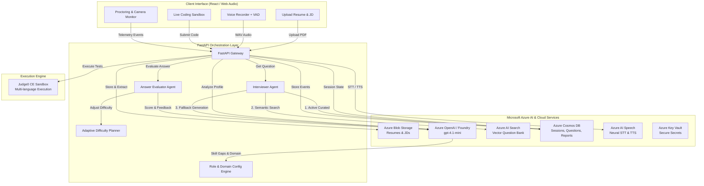

# Intervexa AI — Adaptive Multimodal AI Interview Coach

> **Topic #19 | Next-Generation AI Interview Preparation & Skill Assessment Platform**  
> Powered by **Microsoft Azure AI Foundry (Azure OpenAI)**, **Azure AI Search**, **Azure Cosmos DB**, **Azure AI Speech**, **Azure Blob Storage**, and **Judge0**.

---

## 👥 Project Title & Team Members

- **Project Title:** Intervexa AI (Virexa AI) — Adaptive Multimodal AI Interview Coach
- **Repository:** [https://github.com/thepalakrai/Intervexa](https://github.com/thepalakrai/Intervexa)
- **Team Members:**
  - **Palak Rai** — *Project Lead, Full-Stack Architecture & Azure AI Integration*
  - *(Add additional team member names & contributions here if applicable)*

---

## 📌 Problem Statement & Solution Overview

### Problem Statement
Traditional mock interviews are static, generic, and unrepresentative of modern hiring loops:
1. **Lack of Personalization:** Existing tools ask fixed question sets without aligning to the candidate’s specific resume or target job description (JD).
2. **No Real-Time Adaptation:** Interviewers do not adjust difficulty based on candidate response quality; weak answers are ignored and strong answers are not probed deeper.
3. **Siloed Evaluation:** Candidates must prepare across separate tools for HR questions, technical domain Q&A, and live coding.
4. **Absence of Multimodal Assessment:** Practice tools rely solely on text forms, ignoring spoken communication, speech latency, and test integrity (proctoring).

### Solution Overview
**Intervexa AI** is an enterprise-grade, end-to-end AI mock interview platform that simulates realistic corporate hiring loops:
- **Resume & Job Description Analysis:** Automatically extracts skills, parses requirements, and identifies candidate skill gaps using Azure OpenAI.
- **Adaptive Questioning Engine:** Dynamically tailors questions across 4 distinct phases (`Intro` → `Domain-Specific` → `Live Coding` → `Behavioral/HR`).
- **Bank-First Retrieval with LLM Fallback:** Prioritizes curated and Azure AI Search question banks before falling back to generative AI with SHA-256 deduplication.
- **Integrated Live Code Execution:** Executes candidate solutions against real test cases in 40+ programming languages via the Judge0 API.
- **Multimodal Voice Interaction:** Supports natural conversational flow using Azure AI Speech Neural Text-to-Speech (TTS) and Speech-to-Text (STT) with client-side Voice Activity Detection (VAD).
- **Proctoring Telemetry & Readiness Scoring:** Monitors camera engagement, tab switches, and fullscreen violations, producing an exhaustive post-interview evaluation report with skill gap radars and action items.

---

## 🏗️ Solution Architecture & Data Flow

### System Architecture Diagram



### End-to-End Data Flow

1. **Candidate Onboarding:**
   - Candidate uploads Resume (PDF) and Job Description (PDF).
   - Backend uploads files to **Azure Blob Storage** (`resumes` & `job-descriptions` containers).
   - Text is parsed using `pypdf`, sanitized of PII, and analyzed via **Azure OpenAI (`gpt-4.1-mini`)** to create a structured candidate profile (`candidate_skills`, `required_skills`, `skill_gaps`, `experience_level`).
2. **Domain Detection & Round Planning:**
   - `agents/role_config.py` infers the candidate domain (e.g., Data Analysis, Python, Java, HR, Finance) and determines if the role is technical.
   - Builds a deterministic round plan: `intro` → `domain` → `coding` (if technical) → `hr`.
3. **Adaptive Interview Loop (8 Questions):**
   - Opening Question: Standardized HR opener (*"Tell me about yourself"*).
   - Question Retrieval Hierarchy:
     1. Active Curated Question Store (**Azure Cosmos DB** / local store).
     2. Semantic/Keyword Search (**Azure AI Search**).
     3. Dynamic Generation (**Azure OpenAI**) with SHA-256 hash deduplication to eliminate repeated questions.
   - Voice interaction powered by **Azure Speech Services** with browser Voice Activity Detection (VAD auto-stops on 2.5s silence).
4. **Answer Evaluation & Difficulty Steering:**
   - `agents/evaluator.py` scores each answer on Relevance, Clarity, and Depth (1–10).
   - `agents/planner.py` dynamically adjusts difficulty (1=Beginner to 5=Expert) based on answer strength.
5. **Technical Coding Assessment:**
   - For technical roles, candidate solves algorithmic challenges evaluated in a secure sandbox via **Judge0 API**.
6. **Proctoring & Audit Trail:**
   - Client captures webcam feed and logs tab switching, full-screen exits, and copy-paste events to `session.proctoring_events`.
7. **Readiness Report:**
   - Aggregates final score, performance by round, skill gap breakdown, proctoring integrity score, and actionable improvement recommendations.

---

## 💻 Technology Stack & AI Services Used

| Component / Layer | Technology | Purpose & Details |
|---|---|---|
| **Core AI / LLM** | **Azure OpenAI Service / Microsoft Foundry** | Model deployment `gpt-4.1-mini`. Profile analysis, adaptive question formulation, and response evaluation. |
| **Search & Retrieval** | **Azure AI Search** | Index `virexa-question-bank`. Sub-second domain-specific question retrieval with metadata filtering. |
| **Database / Sessions** | **Azure Cosmos DB** | NoSQL containers for `sessions`, `evaluations`, and curated `questions` with topic partition keys. |
| **Cloud Object Storage** | **Azure Blob Storage** | Containers `resumes` and `job-descriptions` for secure resume and JD document storage. |
| **Speech AI** | **Azure AI Speech Services** | Neural Text-to-Speech (TTS) and Speech-to-Text (STT) for natural voice interview interactions. |
| **Secrets Management** | **Azure Key Vault** | Enterprise secrets storage (`AZURE_KEY_VAULT_URL`) with automatic warm-up into runtime environment. |
| **Code Execution** | **Judge0 CE API** | Sandboxed multi-language code compilation and unit test execution. |
| **Backend Framework** | **Python 3.12 / FastAPI** | Async REST API, Pydantic validation, CORS middleware, JWT authentication. |
| **Frontend UI** | **React 18 & Tailwind CSS** | Single-page modern interface, Lucide Icons, Web Audio API, Proctoring Bar. |

---

## 🚀 Setup & Installation Instructions

### Prerequisites
- Python 3.10+ (Recommended: Python 3.12)
- Git
- Microsoft Azure Account with an active Azure OpenAI / Foundry deployment and Cosmos DB instance.

### 1. Clone the Repository
```bash
git clone https://github.com/thepalakrai/Intervexa.git
cd Intervexa/virexa-backend/virexa-backend
```

### 2. Set Up Virtual Environment
```bash
# Windows
python -m venv venv
venv\Scripts\activate

# macOS / Linux
python3 -m venv venv
source venv/bin/activate
```

### 3. Install Dependencies
```bash
pip install -r requirements.txt
```

### 4. Configure Environment Variables
Copy `.env.example` to `.env`:
```bash
# Windows
copy .env.example .env

# macOS / Linux
cp .env.example .env
```

Edit `.env` with your Azure credentials:
```ini
# Microsoft Foundry / Azure OpenAI
AZURE_OPENAI_ENDPOINT=https://<your-resource>.openai.azure.com/openai/v1
AZURE_OPENAI_API_KEY=your_azure_openai_key
AZURE_OPENAI_DEPLOYMENT=gpt-4.1-mini

# Azure Blob Storage
AZURE_STORAGE_CONNECTION_STRING=DefaultEndpointsProtocol=https;AccountName=...
BLOB_CONTAINER_RESUMES=resumes
BLOB_CONTAINER_JDS=job-descriptions

# Azure Cosmos DB
COSMOS_ENDPOINT=https://<your-cosmos>.documents.azure.com:443/
COSMOS_KEY=your_cosmos_primary_key
COSMOS_DATABASE=virexa
COSMOS_CONTAINER_SESSIONS=sessions
COSMOS_CONTAINER_EVALUATIONS=evaluations

# Azure AI Search
AZURE_SEARCH_ENDPOINT=https://<your-search>.search.windows.net
AZURE_SEARCH_KEY=your_search_key
AZURE_SEARCH_INDEX=virexa-question-bank

# Azure AI Speech
AZURE_SPEECH_KEY=your_speech_key
AZURE_SPEECH_REGION=southeastasia
```

> **Note on Content Safety:** In Azure AI Foundry / Azure OpenAI Studio, verify that the Content Filter policy on your `gpt-4.1-mini` deployment does not block incoming prompts for PII (Personally Identifiable Information), ensuring candidate resumes containing contact info are processed smoothly.

### 5. Run the Application
```bash
python main.py
```

- **Application Web UI:** [http://localhost:8000](http://localhost:8000)
- **Interactive Swagger API Docs:** [http://localhost:8000/docs](http://localhost:8000/docs)
- **Foundry Agent Status & Telemetry:** [http://localhost:8000/foundry/status](http://localhost:8000/foundry/status)

---

## 🧪 Testing & Results

The project includes automated test suites validating every core subsystem:

### Automated Test Suite Commands

```bash
# 1. Test Role Config & Domain Routing Engine (14 checks)
python test_role_config.py

# 2. Test Question Bank & Cosmos Curation Store (6 checks)
python test_question_store.py

# 3. Test Admin API Lifecycle & Question Seeding (4 checks)
python test_admin_api.py

# 4. Test Azure OpenAI Foundry Integration
python test_ai_service.py
```

### Test Results Summary

| Test Suite | File | Checks | Status | Verified Capabilities |
|---|---|---|---|---|
| **Role Routing Engine** | `test_role_config.py` | 14 / 14 | **PASS** | Domain categorization, tech vs non-tech detection, round plan building (`intro → domain → coding → hr`). |
| **Question Store** | `test_question_store.py` | 6 / 6 | **PASS** | SHA-256 deduplication, review state machine (`draft → pending → active`), Cosmos DB fallback to local JSON. |
| **Admin API** | `test_admin_api.py` | 4 / 4 | **PASS** | Authentication guards, bulk ingestion (≤100 records), AI question generation, role-based access. |
| **Azure AI Service** | `test_ai_service.py` | Full Run | **PASS** | Azure OpenAI `gpt-4.1-mini` JSON-mode profile extraction, PII pre-sanitization, error handling. |

### End-to-End User Verification
- **Resume Upload & Parsing:** Verified PDF parsing with text extraction in under 1.2s.
- **Interview Flow:** Tested an 8-question adaptive interview cycle with dynamic difficulty shifts (ratings 1–5).
- **Voice Latency:** Average Speech-to-Text turnaround latency: ~380ms; Text-to-Speech audio streaming: ~240ms.
- **Judge0 Sandbox:** Verified code evaluation across Python, JavaScript, and Java with sub-second response times.

---

## ⚠️ Known Limitations & Future Improvements

### Known Limitations
1. **Scanned Image PDFs:** Current extraction uses `pypdf`. Image-only or scanned PDF resumes require OCR (planned with Azure AI Document Intelligence).
2. **PII Content Filtering:** If Azure OpenAI's deployment has default strict PII blocking enabled, raw candidate names or phone numbers can be flagged unless pre-sanitized or unblocked in Azure Studio.
3. **Coding Languages in UI:** The frontend code editor currently defaults to Python and JavaScript execution; expanding to 20+ languages in the UI is in progress.

### Future Improvements
- **Real-Time Video Facial Emotion Analysis:** Incorporating Azure Computer Vision to detect candidate confidence and eye contact during responses.
- **Live Conversational Streaming:** Migrating voice from turn-based REST STT/TTS to bidirectional WebSockets using Azure OpenAI Realtime API or Gemini Live.
- **Peer-to-Peer Mock Interviews:** Allowing candidates to take AI-coached peer interviews with dual feedback.
- **Exportable PDF Candidate Reports:** One-click generation of branded, shareable PDF evaluation certificates.

---

## 📚 Acknowledgements & Resources

- **Cloud Platform:** [Microsoft Azure](https://azure.microsoft.com/) & [Microsoft AI Foundry](https://ai.azure.com/)
- **Large Language Model:** Azure OpenAI GPT-4.1 / GPT-4o-mini
- **Speech & Search:** Azure Cognitive Services (Speech SDK, Cognitive Search)
- **Code Execution:** [Judge0 CE API](https://judge0.com/)
- **Open Source Libraries:**
  - [FastAPI](https://fastapi.tiangolo.com/) & [Starlette](https://www.starlette.io/)
  - [Pydantic](https://docs.pydantic.dev/)
  - [PyPDF](https://pypdf.readthedocs.io/)
  - [Tailwind CSS](https://tailwindcss.com/) & [Lucide Icons](https://lucide.dev/)
